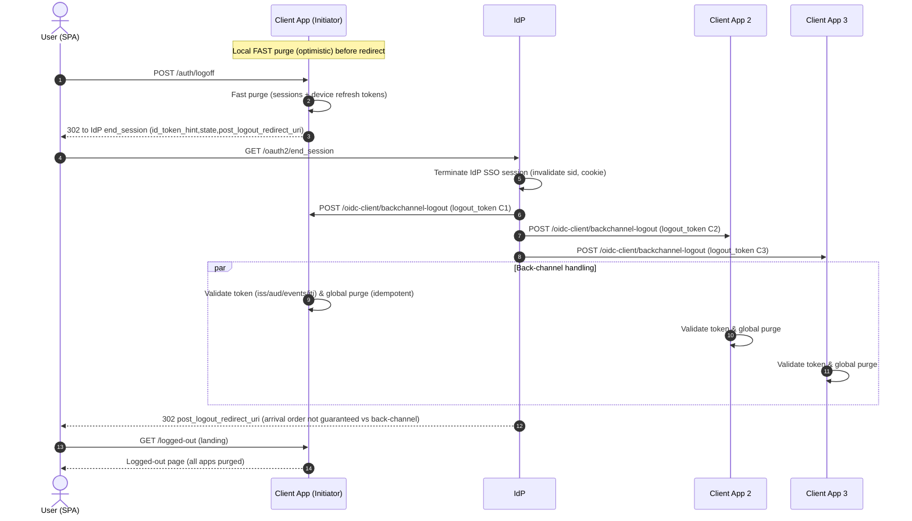
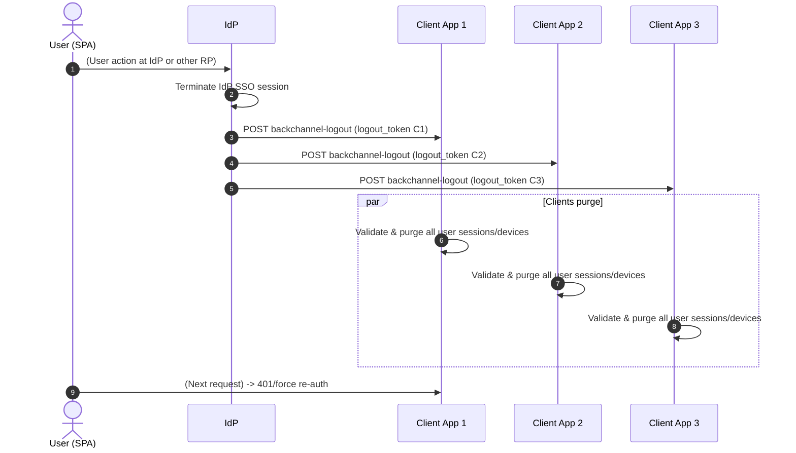
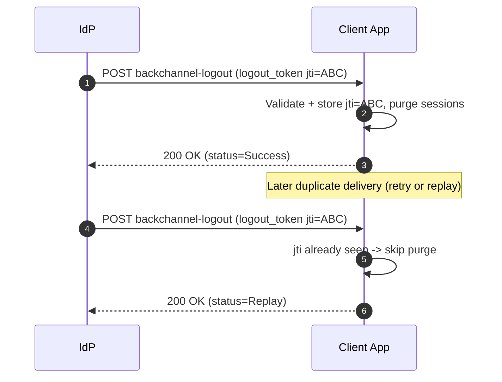

# Single Logout (SLO) — Global (All Apps, All Devices) (PAR + PKCE) — MicroM Multi‑Tenant

**Policy (Target Model)**  
Any SLO trigger (user logout from a Client SPA, explicit logout in IdP SPA, or administrative/global trigger) MUST:
1. Terminate the IdP SSO session (server + SSO cookie via front‑channel end_session).
2. Enumerate **all** MicroM OIDC client applications where the user has at least one active session/device.
3. Emit one back‑channel `logout_token` (JWT) per client application (per client_id).
4. Each client application MUST immediately purge:
   - All local sessions for the user across all its devices.
   - All per‑device refresh tokens (DB + cookies).
5. Idempotency enforced via `jti` (per client).
6. If a client initiated the logout, it still performs a *local fast purge* before redirecting the browser, then relies on back‑channel for consistency confirmation.

`sid` is treated as a correlation identifier (for diagnostics, analytics, cross-app linkage) — **not** a scope boundary. Logout is always user-global across all apps/devices; `sid` presence improves traceability.

> Status: This document defines the desired final contract. Some pieces (cross-app enumeration, broadcast emission, retry strategy) may still be pending implementation.

---

## Terminology

| Term | Meaning |
|------|---------|
| SPA | Browser frontend (Client SPA or IdP SPA) |
| MicroM IdP App | MicroM tenant app whose role is Identity Provider |
| MicroM Client App | MicroM tenant app acting as OIDC Relying Party / Client |
| IdP SSO Session | Server + browser cookie establishing identity at IdP |
| Back‑Channel Logout | Server→Server POST with `logout_token` |
| Front‑Channel Logout | Browser redirect to IdP `end_session_endpoint` |
| Global Purge | Complete removal of all user sessions, all apps, all devices |

Base path pattern: `https://{host}/{baseApiRoot}/{app}/...`

---

## Prerequisites

### IdP
- `end_session_endpoint` exposed (front‑channel initiation & user visible logout)
- `backchannel_logout_uri` for each client, e.g. `POST https://{host}/{baseApiRoot}/{client_app}/oidc-client/backchannel-logout`
- Session index table (e.g. `ApplicationOidcActiveSessions`) queryable by `sub` (and optionally `sid`)
- Capability to enumerate active client_ids for a user quickly (indexed by username / subject)

### Client Apps
- Endpoint: `POST /{app}/oidc-client/backchannel-logout` accepting `logout_token` (form field `logout_token`).
- Local session + refresh token storage keyed by user and device (must purge all for user).
- Fast local logout endpoint: `POST /{app}/auth/logoff` (CSRF protected if cookie-based).

### Shared (Recommended)
- Replay cache: (jti → expiresUtc) distributed (e.g. Redis) for multi-node reliability.
- Clock skew allowance (e.g. ±120s) for iat/exp validation.

---

## Data Model Requirements

| Need | Detail |
|------|--------|
| Global Session Index | Table linking (app_id, username/sub, device_id, sid?, refresh_expiry, optional idp_refresh) |
| Purge Primitive | Single stored procedure (or service op) to delete all user sessions for given sub across one app |
| Enumeration | Query listing distinct app_ids for a user (efficient index) |
| Telemetry | Log [timestamp, sub, sid, jti_prefix, client_id, sessionsPurged, devicesPurged, status] |

---

## Global Logout Triggers

| Trigger | Initiator | Front‑Channel? | Back‑Channel Emission | Result |
|---------|-----------|---------------|------------------------|--------|
| RP (Client) Logout | Client SPA → Client API → IdP | Yes (redirect to IdP) | Yes (IdP emits tokens) | Global purge |
| IdP UI Logout | IdP SPA → IdP API | Yes | Yes | Global purge |
| Admin Forced Logout | Admin tool / API → IdP | Optional (system) | Yes | Global purge |
| Back‑Channel Only Replay | IdP retry / duplicate | No | Already emitted | Idempotent (200) |

---

## Unified Flow — Global Logout (Front + Back) (Ideal Path)

1. **Client SPA** → `POST /{clientApp}/auth/logoff`  
   Local immediate purge (optimistic), capture current `id_token` (for id_token_hint).  
2. **Client API** → redirect → IdP `end_session_endpoint?id_token_hint=...&post_logout_redirect_uri=...&state=...`  
3. **Browser** → IdP `end_session_endpoint`  
4. **IdP**:  
   a. Validates `id_token_hint` & session authenticity.  
   b. Terminates IdP SSO session (cookie/session store).  
   c. Enumerates all client apps with active user sessions.  
   d. For each client app: build `logout_token` (claims below) and `POST backchannel-logout`.  
5. **Each Client App**:  
   - Validate `logout_token`.  
   - Check `jti` replay (if seen → 200 OK).  
   - Purge all local sessions + refresh tokens for `sub` (even if front-channel already purged).  
   - Return 200 (always unless malformed / invalid signature).  
6. **IdP** → Browser: redirect to `post_logout_redirect_uri` (OPTIONAL; may be IdP SPA or original client’s landing page).  
7. **Client SPA**: logged-out state; any remaining access tokens expire or are rejected (server enforces purge).

> If Client SPA is not the original initiator (e.g., user logged out from IdP or another RP), only steps 4–5–7 occur (no initial front-channel from that SPA).

---

## Back‑Channel logout_token (Per Client)

`Content-Type: application/x-www-form-urlencoded`  
Body: `logout_token=<JWT>`

**Required Claims**

| Claim | Purpose |
|-------|---------|
| iss | IdP issuer (exact match) |
| aud | Client app_id (optional but recommended) |
| sub | Subject (global purge key) |
| sid | OPTIONAL (correlation / analytics) |
| iat | Issued-at (freshness check) |
| exp | Optional (bounded lifetime) |
| jti | Replay detection |
| events | Must contain only key `http://schemas.openid.net/event/backchannel-logout` |

**Example (decoded)**:
```json
{ 
    "iss": "https://idp.example.com/", 
    "sub": "00u123abcDEF", 
    "aud": "YOUR_CLIENT_ID", 
    "iat": 1735870000, 
    "exp": 1735870060, 
    "jti": "2f6d9e6b-7a7c-4c1e-a37a-53c7b8f0a1a5", 
    "sid": "08b1f1f2-9f2e-4d5c-b8c1-3de7b1d90f2a", 
    "events": { 
        "http://schemas.openid.net/event/backchannel-logout": {} 
        } 
}
```

**Validation Rules**

| Check | Requirement |
|-------|-------------|
| Signature | Verify via IdP JWKS |
| `iss` | Exact issuer match |
| `aud` | If present matches client_id; if absent still valid |
| `iat` | Not in future beyond skew (e.g. +120s) |
| `exp` | If present: now ≤ exp + skew; else enforce max age from `iat` (e.g. 10m) |
| `jti` | Single-use (replay → 200 OK) |
| `events` | Contains ONLY `http://schemas.openid.net/event/backchannel-logout` |
| `sid` / `sub` | At least one present |
| `sub` | Used for global purge key |

**Global Invalidation (Pseudo)**

```
if replayCache.Exists(jti): 
    return 200 

replayCache.Add(jti, expOr(now+15mCap)) 
PurgeAllUserSessions(sub) 
PurgeAllDeviceRefreshTokens(sub) 
return 200
```

Unknown user / already removed → still 200 (idempotent).

---

## End Session Request (App → IdP)

```
GET https://idp.example.com/oauth2/end_session
    ?id_token_hint=eyJ... 
    &post_logout_redirect_uri=https%3A%2F%2F{host}%2F{baseApiRoot}%2F{app}%2Flogged-out 
    &state=RANDOM_STATE
```

---

## Global SLO (All Devices)



## IdP‑Initiated (User logs out at IdP or another RP)


## Replay / Idempotent Back‑Channel (Optional)

---

## Helper Notes

- Extract token: read `logout_token` form field first.
- Replay cache: `(jti → expiresUtc)` with lazy cleanup.
- Purge must remove:
  - All `ApplicationOidcActiveSessions` rows for `sub`
  - Per-device refresh tokens (DB + cookies)
  - Server-side auth cookies / principals
- Return 200 for: success, replay, unknown user.
- Return 400/401 only on malformed / invalid signature.

---

## Best Practices (Global Mode)

- Uniform global logout prevents partial session drift.
- Enforce max accepted age if `exp` missing.
- Use derived key separation (state HMAC vs JWT signing).
- Minimal logging: `{ evt: backchannel_logout, sub, sid?, jti_prefix, removedCount, replay }`.
- Capture metrics (success, invalidSignature, replay, duration).

---

## Summary

MicroM’s SLO design applies unconditional global user logout on any logout trigger. 
This simplifies reasoning, guarantees consistent cross-device behavior, and preserves idempotency via 
`jti` replay protection.

## Single Logout (SLO) — Deterministic sid and target_link_uri

- EndSession fan-out includes `logout_token` always with `sub`. `sid` is included when a server-side session is present.
- When an RP includes `target_link_uri` in its previous authorization request and that PAR/authorize session is linked to a server-side session, the IdP will include (or allow) a post-logout redirect to the validated `target_link_uri` where appropriate.
- Back-channel logouts will continue to be delivered to registered back-channel endpoints. Front-channel logout will redirect to the RP's logout callback; if `target_link_uri` was provided and validated, it will be considered as a post-logout target subject to the same origin rules as redirect URIs.
- Logging and diagnostics:
  - If `sid` is missing for a user when a logout fan-out runs, the IdP includes `sub` and proceeds (fan-out is still attempted).
  - If `target_link_uri` is present but invalid for the client, the IdP will skip redirect to it and log `target_link_uri_invalid` (no sensitive data in logs).
