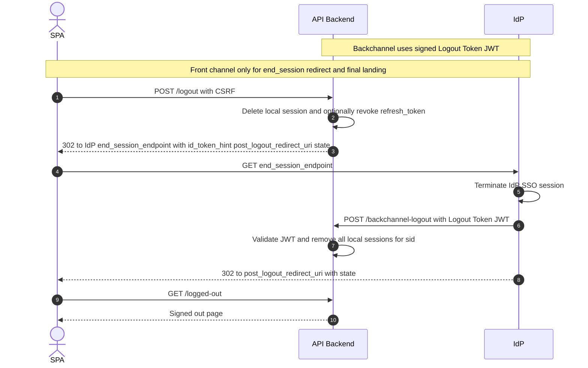

# Single Logout (SLO) without iframe — PAR/PKCE

**Definitions:**

* **SPA**: your browser frontend
* **API Backend**: your server side app (BFF)
* **IdP**: Identity Provider
* **IdP SPA**: the IdP’s own login application

---

## Prerequisites

* **IdP**

  * `end_session_endpoint` enabled
  * `post_logout_redirect_uri` of your **API Backend** registered
  * `backchannel_logout_uri` of your **API Backend** registered
  * `id_token` contains `sid` or IdP correlates session server side
* **API Backend**

  * `POST /logout` (CSRF protected)
  * `POST /backchannel-logout` to receive the Logout Token (JWT)
  * Local session store indexable by `sid` and by user
  * Optional use of IdP `revocation_endpoint` for `refresh_token`

---

## Flow A — App-initiated Logout (API Backend starts logout)

1. **SPA → API Backend**: `POST /logout` with CSRF token
2. **API Backend**

   * Deletes local session immediately or marks it for termination
   * Optionally calls IdP `revocation_endpoint` to revoke `refresh_token`
   * Builds URL to IdP **`end_session_endpoint`** with:

     * `id_token_hint=<most recent id_token>`
     * `post_logout_redirect_uri=<https://app.example.com/logged-out>`
     * `state=<random logout state>`
3. **API Backend → SPA**: `302` to IdP `end_session_endpoint`
4. **SPA → IdP**: `GET end_session_endpoint`
5. **IdP → API Backend**: **Back-Channel Logout**

   * IdP `POST` to `https://app.example.com/backchannel-logout` with a signed **Logout Token (JWT)**
6. **API Backend**

   * Validates Logout Token signature and claims
   * Removes all local sessions linked to the `sid` or `sub`
   * Idempotent by `jti`
7. **IdP → SPA**: `302` to `post_logout_redirect_uri` with `state`
8. **SPA ← API Backend**: shows signed out page

> No iframes are used. The IdP notifies all clients via **backchannel** using the signed Logout Token.

---

## Flow B — IdP-initiated Logout (user signs out at the IdP)

1. User signs out in **IdP** or another client
2. **IdP → API Backend**: sends **Back-Channel Logout** to `/backchannel-logout`
3. **API Backend**: validates Logout Token and removes sessions for that `sid` or `sub`
4. When the user returns to the **SPA**, the local session is gone and login is required

---

## Logout Token (received by API Backend)

Example payload of the **JWT** posted by the IdP to `/backchannel-logout`:

```json
{
  "iss": "https://idp.example.com/",
  "sub": "00u123abcDEF",
  "aud": "YOUR_CLIENT_ID",
  "iat": 1735870000,
  "jti": "2f6d9e6b-7a7c-4c1e-a37a-53c7b8f0a1a5",
  "sid": "08b1f1f2-9f2e-4d5c-b8c1-3de7b1d90f2a",
  "events": {
    "http://schemas.openid.net/event/backchannel-logout": {}
  }
}
```

**Validate**

* Signature using IdP **JWKS**
* `iss` equals configured issuer
* `aud` matches your `client_id` if provided by the IdP
* `iat` is recent within small clock skew
* `jti` not seen before (idempotency)
* `events` contains the backchannel logout URI key
* `sid` or `sub` present; map to all local sessions and delete them

---

## End Session request (API Backend → IdP)

```
GET https://idp.example.com/oauth2/end_session
  ?id_token_hint=eyJ...
  &post_logout_redirect_uri=https%3A%2F%2Fapp.example.com%2Flogged-out
  &state=RANDOM_STATE
```

---

## Mermaid — SLO without iframe (Back-Channel + App-initiated)



---

## C# (.NET 8) — Validate Logout Token at `/backchannel-logout`

```csharp
using System.IdentityModel.Tokens.Jwt;
using Microsoft.IdentityModel.Protocols;
using Microsoft.IdentityModel.Protocols.OpenIdConnect;
using Microsoft.IdentityModel.Tokens;

var authority = "https://idp.example.com";
var clientId = "YOUR_CLIENT_ID";
var metadata = $"{authority}/.well-known/openid-configuration";
var configMgr = new ConfigurationManager<OpenIdConnectConfiguration>(
    metadata,
    new OpenIdConnectConfigurationRetriever(),
    new HttpDocumentRetriever { RequireHttps = true }
);

app.MapPost("/backchannel-logout", async (HttpRequest req) =>
{
    // IdP posts application/x-www-form-urlencoded or JSON with logout_token
    string logoutToken = await ExtractLogoutTokenAsync(req);

    var oidc = await configMgr.GetConfigurationAsync(default);
    var tokenHandler = new JwtSecurityTokenHandler();
    var parameters = new TokenValidationParameters
    {
        ValidIssuer = oidc.Issuer,
        ValidateIssuer = true,
        ValidAudience = clientId, // if your IdP sets aud; otherwise set ValidateAudience = false
        ValidateAudience = true,
        IssuerSigningKeys = oidc.SigningKeys,
        ValidateIssuerSigningKey = true,
        RequireSignedTokens = true,
        RequireExpirationTime = false, // logout tokens are typically short lived and may omit exp
        ValidateLifetime = false,      // rely on iat freshness check below
        ClockSkew = TimeSpan.FromMinutes(1)
    };

    var principal = tokenHandler.ValidateToken(logoutToken, parameters, out var st);
    var jwt = (JwtSecurityToken)st;

    // Must contain the backchannel logout event
    var hasEvent = jwt.Claims.Any(c => c.Type == "events" && c.Value.Contains("http://schemas.openid.net/event/backchannel-logout"));
    if (!hasEvent) return Results.BadRequest();

    // Fresh iat
    var iatClaim = jwt.Claims.FirstOrDefault(c => c.Type == JwtRegisteredClaimNames.Iat)?.Value;
    if (iatClaim != null && long.TryParse(iatClaim, out var iat))
    {
        var iatDt = DateTimeOffset.FromUnixTimeSeconds(iat);
        if (DateTimeOffset.UtcNow - iatDt > TimeSpan.FromMinutes(5))
            return Results.BadRequest();
    }

    // Idempotency by jti
    var jti = jwt.Claims.FirstOrDefault(c => c.Type == JwtRegisteredClaimNames.Jti)?.Value;
    if (jti != null && await AlreadyProcessedAsync(jti))
        return Results.Ok();

    // Resolve sessions by sid or sub
    var sid = jwt.Claims.FirstOrDefault(c => c.Type == "sid")?.Value;
    var sub = jwt.Claims.FirstOrDefault(c => c.Type == JwtRegisteredClaimNames.Sub)?.Value;

    await RemoveLocalSessionsAsync(sid, sub);
    if (jti != null) await MarkProcessedAsync(jti);

    return Results.Ok();
});
```

**Helper notes**

* `ExtractLogoutTokenAsync` should read either `logout_token` from form body or the raw JWT from JSON, depending on your IdP
* `AlreadyProcessedAsync` and `MarkProcessedAsync` implement an idempotency store keyed by `jti`
* `RemoveLocalSessionsAsync` should delete all local sessions linked to that `sid` or `sub`

---

## Best practices

* Prefer **Back-Channel Logout** for reliability; avoid front-channel fan-out
* Make all operations **idempotent** using `jti`
* Revoke `refresh_token` on app-initiated logout when appropriate
* Treat `sid` as a per-browser-session identifier; for global logout, use `sub` to remove all sessions
* Log `sid`, `sub`, and `jti` minimally and never log full JWTs
