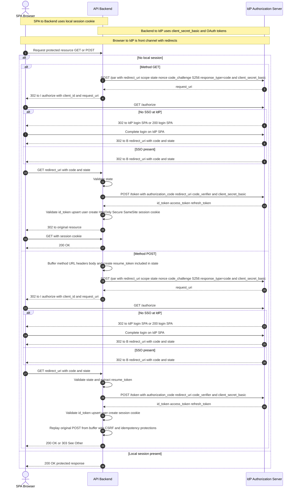

# End-to-end OIDC Flow (PAR only) with IdP Login SPA, SSO, and Protected POST

This describes the complete Authorization Code flow with **PAR** and **PKCE** in a BFF architecture where the IdP has its own **login SPA**. It covers both cases: user **has SSO** vs **does not**; and what to do when the original request is a **POST**.

---

## Flow (PAR only)

1. **SPA → API Backend**: requests a protected resource **GET or POST**
2. **API Backend → IdP**: `POST /par` with `client_secret_basic`, `redirect_uri`, `scope`, `state`, `nonce`, `code_challenge=S256`, `response_type=code`
3. **IdP → API Backend**: returns `request_uri`
4. **API Backend → SPA**: `302 Location` to `https://idp.example.com/oauth2/authorize?client_id=...&request_uri=...`
5. **SPA (browser) → IdP**: `GET /authorize?client_id=...&request_uri=...`

   * **5.a No SSO present**: `/authorize` **302 →** IdP **login SPA** (e.g., `https://idp.example.com/login`) or serves the login SPA directly

     * User signs in on the IdP login SPA
     * IdP resumes the authorization and **ends at** `/authorize`, which then issues **302 → `redirect_uri`** carrying `code` and `state`
   * **5.b SSO present**: `/authorize` immediately issues **302 → `redirect_uri`** with `code` and `state`
6. **SPA → API Backend**: `GET redirect_uri` with `code` and `state`
7. **API Backend**: validates `state`
8. **API Backend → IdP**: `POST /token` with `grant_type=authorization_code`, `code`, `redirect_uri`, `code_verifier`, authenticated via `client_secret_basic`
9. **IdP → API Backend**: returns `id_token`, `access_token`, `refresh_token`
10. **API Backend**: validates `id_token`, upserts user, creates **HttpOnly Secure SameSite** local session cookie
11. **If the original request was GET**

    * **API Backend → SPA**: `302` back to the original resource
    * **SPA → API Backend**: `GET` with the session cookie → **200 OK**
12. **If the original request was POST**

    * At step 2, backend already **buffered** the incoming POST (method, URL, headers, body) and generated a **resume\_token** encoded inside `state`
    * After step 10, backend **replays the original POST** safely from the buffer (transactional, CSRF-checked, idempotent)
    * **API Backend → SPA**: **200 OK** with the POST result, or **303 See Other** to a result page

---

## Mermaid Diagram (PAR, SSO vs No SSO, and POST Handling)

---

## Key Notes for POST

* Do **not** redirect the raw POST to the IdP. A 302 turns POST into GET and leaks or loses body. 307 or 308 would still send the body to the wrong endpoint.
* Prefer the **buffer and resume** pattern in the BFF:

  * Persist `method`, `url`, selected headers, encrypted `body`, `created_at`, and a `csrf_nonce`
  * Generate a `resume_token` and embed it into `state` to resume after the callback
  * Enforce short TTL and one-time use
* Enforce **CSRF** and **idempotency** on replay
* Alternative: **SPA retry** pattern (`401 login_required` + `authorization_uri`), then the SPA re-sends the POST after login
